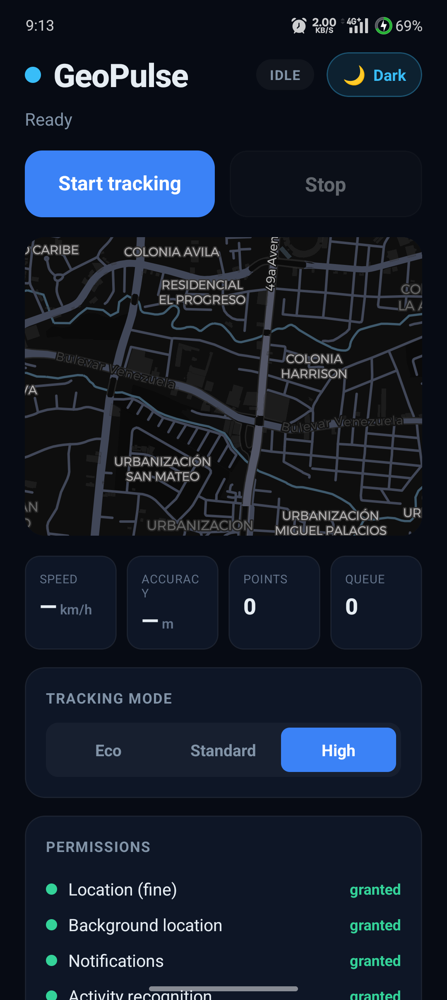
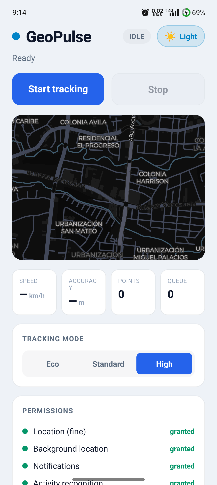
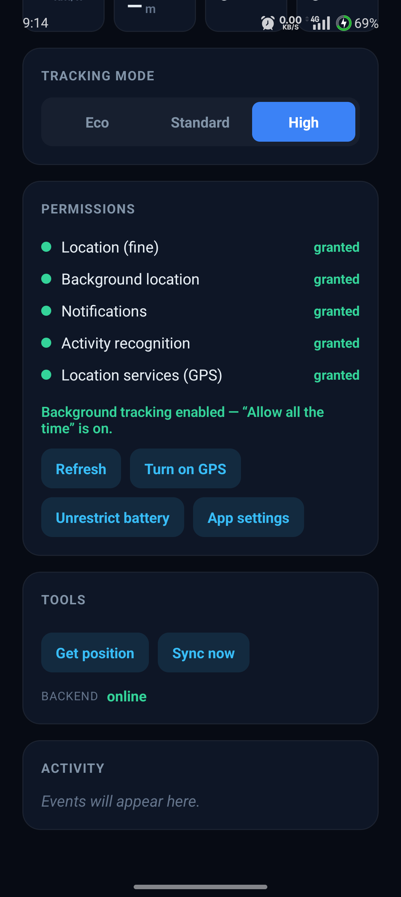
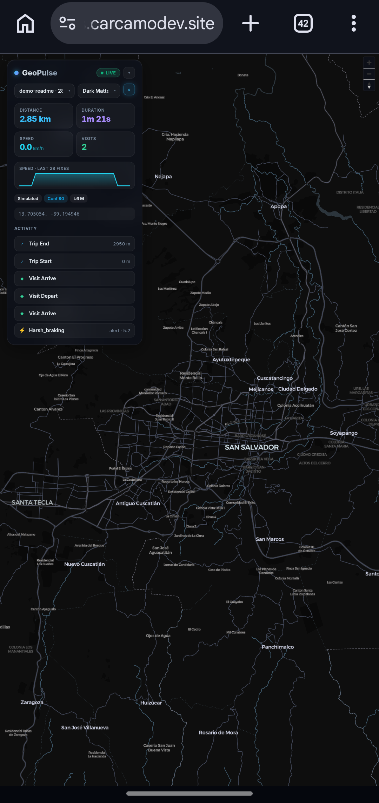

# expo-geopulse

> Open-source background geolocation SDK for **React Native + Expo** (Android), with **C++/NDK Kalman sensor fusion**, battery-smart motion detection, geofencing, and offline sync.

[](https://github.com/ramon3198/expo-geopulse/actions/workflows/ci.yml)
[](https://www.npmjs.com/package/expo-geopulse)
[](./LICENSE)
[](#)
[](#)

GeoPulse is a free, fully open-source alternative to commercial background-geolocation
libraries. It is built on the **Expo Modules API** (Kotlin-first), targets React Native's
**New Architecture**, and drops into an Expo app with a single config-plugin line.

> **Status:** Android only (by design, for now). iOS is not yet implemented.

## Screenshots

The example app (dark & light themes, animated droplet theme reveal) and the
companion real-time dashboard:

| Example app (dark) | Example app (light) | Permissions & tools |
|:---:|:---:|:---:|
|  |  |  |

**Companion dashboard** — live map (MapLibre), route trace, visits, trips and driving events:



---

## Why GeoPulse?

| | GeoPulse | Typical commercial SDK |
|---|---|---|
| License | **MIT, 100% open source** | Proprietary, paid for release builds |
| Source visibility | **Full native source** | Closed native binaries |
| Accuracy | **Kalman fusion in C++/NDK** (jitter ↓, outliers rejected) | Raw fixes, no smoothing |
| Polygon geofencing | **Built-in, free** | Often a paid add-on |
| GMS-free devices | **FusedLocation → LocationManager fallback** | GMS-only |
| Battery | **Stationary detection stops GPS** (Activity Recognition + significant-motion) | Varies |
| Expo integration | **One-line config plugin** | Manual setup |

---

## Features

- Continuous background tracking via a **foreground service** (`foregroundServiceType="location"`, Android 14/15 ready)
- **Fused location** (Google Play Services) with automatic **GMS-free fallback** (`LocationManager.FUSED_PROVIDER`)
- **Kalman sensor fusion in C++/NDK** — smooths GPS jitter, rejects outliers, tightens accuracy (≈80% RMSE reduction when stationary, ≈47% while walking in our synthetic-track tests)
- **Battery intelligence** — Activity Recognition + significant-motion sensor stop GPS while still, resume on movement
- **Adaptive accuracy presets** (`eco` / `standard` / `high`) with optional **auto-degrade on low battery**
- **Reliability signals** — mock-location (spoofing) detection, a per-fix **confidence score (0–100)**, and **signal-outage events**
- **Trip & visit detection** (on-device stay-point algorithm) — turns raw points into `onVisit` (arrive/depart with dwell) and `onTrip` (with real travelled distance) events
- **Driving-behaviour events** (telematics-style, on-device) — harsh braking, harsh acceleration, speeding and idling from the accelerometer + GPS, with a severity score
- **Geofencing** — circular *and* polygon geofences, "infinite" geofences (nearest-100 reconciliation), ENTER / EXIT / DWELL
- **Offline persistence** (SQLite) + **batched HTTP sync** with retry/backoff (WorkManager)
- **Restart on boot** (persisted config) and a headless-safe data pipeline (buffer + sync without a JS runtime)
- **TypeScript-first API** with a one-line **Expo config plugin** that wires up all permissions

---

## Requirements

- **Expo SDK 53+** / React Native **0.76+** (New Architecture — the default today)
- **Android only** (minSdk 24, targets Android 15 / API 35)
- A **development build** (Dev Client) or a bare RN app — **GeoPulse cannot run in Expo Go** because it ships custom native code.

---

## Installation

```bash
npm install expo-geopulse
```

Add the config plugin in `app.json` (this injects the required permissions; the foreground service merges automatically):

```json
{
  "expo": {
    "plugins": [
      ["expo-geopulse", { "requestBackgroundLocation": true }]
    ]
  }
}
```

Then generate native code and run a development build:

```bash
npx expo prebuild --platform android
npx expo run:android
```

> **Building the bundled `example/` in release mode (repo only):** the example
> resolves `expo-geopulse` from the parent dir via Metro's `extraNodeModules`,
> which works for debug but not for the release JS bundler. If you build a
> *release* APK of the example, first link the package into the example so the
> bundler can resolve it:
> ```bash
> # from expo-geopulse/example
> cmd /c mklink /J node_modules\expo-geopulse ..   # Windows (junction)
> # ln -s .. node_modules/expo-geopulse            # macOS/Linux
> ```
> This is only needed for the in-repo example; consumers installing from npm
> don't need it.

### Config plugin options

| Option | Default | Description |
|---|---|---|
| `requestBackgroundLocation` | `false` | Adds `ACCESS_BACKGROUND_LOCATION` ("Allow all the time"). Triggers extra Play Store review. |
| `enableActivityRecognition` | `true` | Adds `ACTIVITY_RECOGNITION` for motion-based battery savings. |
| `allowBatteryOptimizationExemption` | `false` | Adds `REQUEST_IGNORE_BATTERY_OPTIMIZATIONS`. Use sparingly. |

The foreground service, boot receiver and core permissions are merged automatically — so GeoPulse also works in **bare React Native** without the plugin.

---

## Quickstart

**One line to start tracking** — `track()` requests permissions, turns on GPS,
configures, and starts the background service for you:

```ts
import GeoPulse from 'expo-geopulse';

const tracker = await GeoPulse.track((location) => {
  console.log(location.coords.latitude, location.coords.longitude);
});

// ...later
await tracker.stop();
```

Tune it with friendly options (no enums needed):

```ts
const tracker = await GeoPulse.track(onLocation, {
  mode: 'high',                 // 'eco' | 'balanced' | 'high'
  background: true,             // "Allow all the time"
  trips: true,                  // emit onVisit / onTrip
  driving: true,                // emit harsh-braking / speeding / ...
  url: 'https://api.example.com/locations',  // auto-upload
  notification: { title: 'Tracking', text: 'Recording your route' },
});
```

Subscribe to anything with a single `on(...)`, and handle errors by `code`:

```ts
const sub = GeoPulse.on('trip', (e) => console.log(e.action, e.trip.distanceMeters));
GeoPulse.on('driving', (e) => console.log(e.type, e.severity));
sub.remove();

try {
  await GeoPulse.track(onLocation);
} catch (e) {
  if (e.code === 'PERMISSION_DENIED') promptUser();
  if (e.code === 'LOCATION_OFF') askToEnableGps();
}

// A single fresh fix:
const here = await GeoPulse.currentPosition();
```

<details>
<summary>Prefer fine-grained control? The full API is still there.</summary>

```ts
import GeoPulse, { Accuracy } from 'expo-geopulse';

await GeoPulse.ready({ desiredAccuracy: Accuracy.High, distanceFilter: 10, enableKalman: true });
await GeoPulse.requestPermissions();
const sub = GeoPulse.onLocation((loc) => console.log(loc.coords));
await GeoPulse.start();
// ...
await GeoPulse.stop();
sub.remove();
```
</details>

---

## API

### High-level (recommended)
The "just works" layer — most apps only need these:
- `track(onLocation, options?): Promise<Tracker>` — request permissions + turn on GPS + configure + start, in one call. Returns `{ stop() }`. Throws coded errors (`PERMISSION_DENIED` / `LOCATION_OFF`).
- `ensurePermissions({ background? }): Promise<PermissionResult>` — run the full foreground → GPS → background flow; returns `{ granted, reason, ... }`.
- `on(event, cb): EventSubscription` — one typed subscriber for every event: `'location' | 'motion' | 'activity' | 'geofence' | 'provider' | 'heartbeat' | 'error' | 'visit' | 'trip' | 'driving'`.
- `currentPosition(): Promise<Location>` — a single fresh fix (alias of `getCurrentPosition`).
- `TrackOptions`: `mode` (`'eco' | 'balanced' | 'high'`) · `background` · `trips` · `driving` · `url` · `headers` · `notification` · `distanceFilter`.

### Lifecycle & tracking (low-level)
- `ready(config?): Promise<GeoPulseState>` — apply config; call once before `start()`
- `setConfig(config): Promise<GeoPulseState>` — update config while running
- `start(): Promise<GeoPulseState>` / `stop(): Promise<GeoPulseState>`
- `getState(): Promise<GeoPulseState>`
- `getCurrentPosition(options?): Promise<Location>` — single fresh fix

### Permissions & battery
- `requestPermissions(): Promise<PermissionStatus>`
- `getProviderState(): Promise<PermissionStatus>`
- `requestBackgroundPermission(): Promise<PermissionStatus>` · `openAppSettings(): Promise<void>`
- `isIgnoringBatteryOptimizations(): Promise<boolean>`
- `requestIgnoreBatteryOptimizations(): Promise<boolean>`

**Android 11+ partial permission.** The OS lets users grant "While using the app"
but deny "Allow all the time", and background location can usually only be upgraded
from Settings (not a dialog). `getProviderState()` and `ensurePermissions()` report a
coarse `level`: **`none`** · **`foregroundOnly`** · **`background`**.

With `foregroundOnly`, tracking still works **while the app is visible** but pauses
when backgrounded — `start()` emits `onError` `BACKGROUND_PERMISSION_MISSING` (the SDK
never crashes or assumes background). Decide whether to continue degraded or guide the
user to upgrade via `requestBackgroundPermission()` → `openAppSettings()`:

```ts
const p = await GeoPulse.ensurePermissions({ background: true });
if (p.level === 'foregroundOnly') {
  // keep tracking in-app, or: await GeoPulse.openAppSettings();
}
```

### Geofences
- `addGeofence(geofence)` · `addGeofences(list)` · `removeGeofence(id)` · `removeGeofences()` · `getGeofences()`
- A geofence is a **circle** (`latitude`, `longitude`, `radius`) or a **polygon** (`vertices: [lat, lng][]`).

### Trips & visits
- Enable with `enableTripDetection: true` (tune via `visitRadius`, `minVisitDwell`).
- `getActiveTrip(): Promise<Trip | null>` — the trip currently in progress.
- `Trip.distanceMeters` is the sum of **real travelled segments** between consecutive fixes (great-circle, post-Kalman) — not the straight-line start→end. It does **not** interpolate across a stationary-caused GPS gap: when `stopOnStationary` turns GPS off for a stop, the as-the-crow-flies jump on resume is excluded, so a route with long stops isn't over-counted. Jitter accumulated while parked at a confirmed visit is rolled back too.
- Subscribe with `onVisit` (`{ action: 'arrive' | 'depart', visit }`) and `onTrip` (`{ action: 'start' | 'end', trip }`).

### Driving events
- Enable with `enableDrivingEvents: true` (tune `harshAccelThreshold`, `harshBrakeThreshold`, `speedLimit`, `idleTimeout`).
- Subscribe with `onDrivingEvent` — `{ type: 'harsh_braking' | 'harsh_acceleration' | 'speeding' | 'idling', severity, magnitude, speed, location }`.

### Persistence & sync
- `getLocations(): Promise<Location[]>` · `getCount(): Promise<number>` · `destroyLocations()`
- `sync(options?): Promise<SyncResult>` — upload one batch now; resolves `{ count, discarded?, status? }`. Pass `{ returnLocations: true }` to also get the uploaded points (off by default — a big buffer otherwise means megabytes over the JS bridge).

### Testing
- `simulateLocation({ latitude, longitude, accuracy?, speed?, timestamp? })` — inject a fix through the full pipeline (fusion, geofences, trips/visits) to test from your desk without walking a route. Pass increasing `timestamp` values to simulate motion.
- `simulateProviderFailure('gms')` *(debug-only)* — force the GMS-free `LocationManager` fallback even where Play Services exists, to exercise that path; fires `onProviderChange` and subsequent fixes carry a raw `provider`.
- `simulateOutage(durationMs)` *(debug-only)* — simulate a signal loss: fires `onProviderChange` with `outage: true` after `outageThreshold`, then `outage: false` when it recovers.

### Events (each returns an `EventSubscription`)
`onLocation` · `onMotionChange` · `onActivityChange` · `onGeofence` · `onProviderChange` · `onHeartbeat` · `onError` · `onVisit` · `onTrip` · `onDrivingEvent` · `onSyncError`

### Config highlights
`desiredAccuracy` (`Accuracy.High|Balanced|Low|Passive`) · `preset` (`eco|standard|high`) · `lowBatteryThreshold` · `distanceFilter` · `locationUpdateInterval` · `stopOnStationary` · `disableMockLocations` · `outageThreshold` · `enableTripDetection` / `visitRadius` / `minVisitDwell` · `enableKalman` · `accuracyFilter` · `startOnBoot` · `url` / `httpMethod` / `headers` / `params` / `autoSync` / `maxBatchSize` / `maxRecordsToPersist` / `bufferOverflowPolicy` / `discardStatusCodes` / `retryStatusCodes` · `notification`.

---

## How it works

- **Foreground service** keeps tracking alive in the background and posts the required ongoing notification.
- **LocationEngine** prefers `FusedLocationProviderClient`; on GMS-free devices it falls back to `LocationManager`.
- **Kalman fusion (C++/NDK)** runs every fix through `libgeopulse-fusion.so`: accuracy gating, speed-based outlier rejection, and a scalar GPS Kalman filter. Emitted locations carry `filtered: true` and `provider: "kalman"`.
- **MotionManager** uses Activity Recognition transitions + the significant-motion sensor; when `stopOnStationary` is on, GPS is stopped while still and resumed on movement. On that resume the Kalman filter is **reset**, so the first fix after a long stop seeds a fresh state instead of being smoothed against — or rejected as an outlier relative to — the pre-stop position.
- **Offline pipeline**: every location is buffered in SQLite; a WorkManager job uploads batches to `url` with retry/backoff and deletes them on success. Each fix carries a stable `uuid`, so retries are [idempotent](#writing-your-own-backend) — a lost response can't pile up duplicates on the server. The buffer is capped at `maxRecordsToPersist` (default 10000); on overflow it drops per `bufferOverflowPolicy` (`dropOldest` by default) and emits `onError` `BUFFER_OVERFLOW`. Uploads are paginated to `maxBatchSize` points per request (unless `batchSync` sends the whole backlog at once).
- **Boot**: the last config is persisted; if `startOnBoot` is set, tracking resumes after a reboot without opening the app.

---

## Companion backend & dashboard (optional)

The repo ships an optional open-source real-time backend and dashboard so you can
*see* tracking on a live map — point the SDK's `url` at it and you're done.

- **`server/`** — a **FastAPI + WebSocket** backend (SQLite storage). Receives the
  SDK's batches, stores them, and streams every location/event to connected
  dashboards. See [server/README.md](server/README.md).
- **`dashboard/`** — a **React + Vite + MapLibre** dashboard (free OpenStreetMap
  tiles, no API key) that shows the device moving live, the route trace, and a
  feed of trips / visits / driving events.

```bash
# 1. Backend
cd server && pip install -r requirements.txt && uvicorn main:app --port 8787
# 2. Dashboard
cd dashboard && npm install && npm run dev
# 3. Test without a phone
cd server && python simulate.py        # watch the map move

# Or point the SDK at it:
# await GeoPulse.ready({ url: 'http://YOUR_PC_IP:8787/locations', autoSync: true })
```

### Writing your own backend

If you point `url` at your own server, it **must be idempotent**. The SDK buffers
every fix and retries uploads that aren't confirmed, so when a `2xx` response is
lost (network drop, read timeout) the same batch is re-sent and the backend sees
the same points twice.

Every location carries a stable **`uuid`** (UUID v4) generated *on-device at
capture time* — it is identical across retries. Treat it as an idempotency key and
**dedup / upsert by `uuid`** (it is globally unique) so a re-sent point is stored
only once:

```sql
-- e.g. SQLite — the companion server/ scopes the key per device
CREATE UNIQUE INDEX idx_loc ON locations(device, uuid);
INSERT INTO locations (...) VALUES (...) ON CONFLICT(device, uuid) DO NOTHING;
```

Attach a device id and any auth via `headers` / `params` (the companion server
reads an `X-Device-Id` header, defaulting to `"default"`). The request body
(`POST` or `PUT`, gzipped above ~256 bytes with `Content-Encoding: gzip`) is:

- without `params`: a bare array — `[{ "uuid": "…", "timestamp": 1700000000000, "coords": { … }, … }, …]`
- with `params` set: `{ "locations": [ … ], …params }`

Respond `2xx` only after the batch is durably stored. The SDK then deletes its
local copy; on any other status it follows this policy:

| Status | Action | Why |
| --- | --- | --- |
| `2xx` | **delete** the batch | stored successfully |
| `400`, `413`, `422` | **discard** the batch + emit `onError` `BATCH_REJECTED` | the batch is malformed/too-large; retrying the same body loops forever |
| `401` | **retry** + emit `onError` `AUTH_FAILED` | token likely expired — refresh it (see below) |
| `403`, `408`, `429`, `5xx`, network error | **retry** with backoff | transient / recoverable |
| anything else | **retry** with backoff | never drop data unless the batch is at fault |

`Retry-After` (seconds) on a `429`/`503` is honored — the next attempt is delayed
by exactly that long instead of the default exponential backoff. Override the
classification per status with `discardStatusCodes` / `retryStatusCodes` in your
config, and observe every failed attempt via the `onSyncError` event
(`{ status, count }`).

#### Auth tokens

For a static token, put it in `headers`. For a token that **expires**, register a
provider so uploads always use a live one — including background/headless syncs:

```ts
GeoPulse.registerAuthProvider(async () => ({
  Authorization: `Bearer ${await getFreshToken()}`,
}));
```

The SDK calls it before each manual `sync()`, and automatically after a `401`
(`AUTH_FAILED`) — refreshing and re-syncing once (throttled) before backoff. The
headers are persisted natively, so when the app is killed background sync keeps
using the last token; refresh resumes when the app or its headless task next runs.
You can also push headers imperatively with `GeoPulse.setAuthHeaders({ ... })`.

---

## Headless JS task

Set `enableHeadless: true` and register a task at your app's entry point (top of
`index.js`, **outside any component**) to run JS for events even while the app is
killed — the foreground service keeps tracking and spawns a short-lived JS
context per event:

```ts
// index.js
import GeoPulse from 'expo-geopulse';

GeoPulse.registerHeadlessTask(async ({ event, data }) => {
  if (event === 'onLocation') {
    await fetch('https://api.example.com/loc', { method: 'POST', body: JSON.stringify(data) });
  }
});
```

Without it, the *data pipeline* (buffer + HTTP sync via the foreground service)
is still headless-safe on its own — locations are recorded and uploaded to your
`url` even when the app is killed; only custom JS callbacks need the headless task.

### Coalescing (batch delivery)

With a low `distanceFilter`, a moving device can fire `onLocation` every second —
and each one spawns a fresh JS context, which is costly. Set
`headlessCoalesceWindow` (seconds) and/or `headlessCoalesceCount` (number of fixes)
to batch them: the task is invoked once per window/count with **`data` as a
`Location[]`** instead of a single `Location`.

```ts
await GeoPulse.ready({ enableHeadless: true, headlessCoalesceWindow: 30 });

GeoPulse.registerHeadlessTask(async ({ event, data }) => {
  if (event === 'onLocation') {
    const points = Array.isArray(data) ? data : [data]; // batched when coalescing
    await fetch('https://api.example.com/loc', { method: 'POST', body: JSON.stringify(points) });
  }
});
```

Coalescing is **only** for headless JS delivery — the SQLite buffer still stores
(and HTTP-syncs) every fix individually. Off by default (one event per fix).

## Limitations

- **Android only** (for now).
- Requires a **development build** — not Expo Go.

## License

MIT © contributors. See [LICENSE](./LICENSE).
